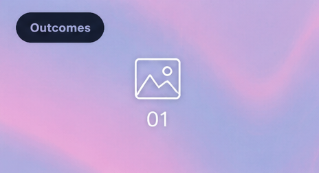
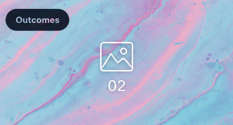
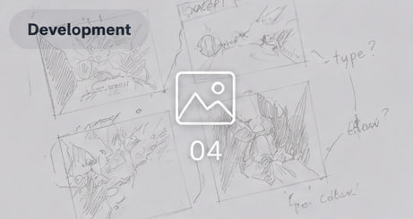
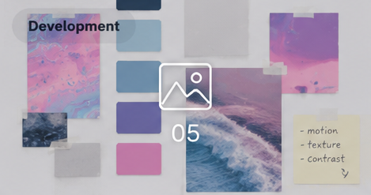

## Foundation Capital
# Amen

> One client. A lot of formats. A visual system flexible enough to
> handle all of them.

Foundation Capital is an ongoing body of work covering everything from
plaplalooloool and annual reports to microsites, newsletters and event
materials.

The challenge was less about creating one recognisable object and more
about maintaining a consistent visual character across projects with
very different purposes, proportions and audiences.

### Building for variety

The work moves between digital and print, from information-heavy
presentations and reports to invitations, menus and event collateral.

Each format needed its own solution while still feeling connected to the
wider Foundation Capital identity. Typography, hierarchy and restrained
graphic elements provided enough consistency without forcing every piece
into the same template.

### Making information work

Many of the projects involved organising substantial amounts of
information. Clear hierarchy and structure were essential, particularly
in presentations and reports where content needed to be understood
quickly.

Other pieces allowed the system to become more expressive. Event
invitations and dinner materials could use scale, typography and
composition more freely while still retaining the client's visual
language.

### A flexible identity

The strongest part of the work is its range. Rather than applying one
fixed style repeatedly, the identity adapts to the job --- sometimes
formal and information-led, sometimes more playful and unexpected.

The result is a collection of work that feels related without looking
repetitive.

#### Notes

-   Consistency does not mean repetition.
-   Different formats need different solutions.
-   Hierarchy carries complex information.
-   A useful identity should be able to stretch.
